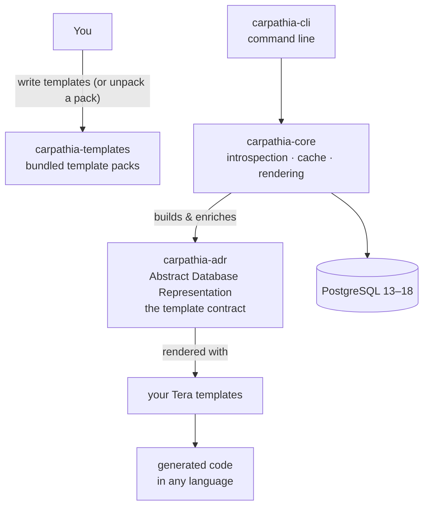

[](https://codecov.io/github/sdoerig/carpathia)


# carpathia — Generate Code from PostgreSQL Schemas

> **Write templates. Generate code. Never write boilerplate again.**

## What is carpathia?

Every application that talks to a database ends up writing the same code over and over: structs that mirror tables, queries that mirror columns, CRUD methods that mirror constraints. And every schema change means touching all of it by hand.

`carpathia` takes that work off your plate. It is a declarative, **language-agnostic code generator**: it introspects your PostgreSQL schema, transforms it into a canonical model, and renders that model through [Tera](https://github.com/Keats/tera) templates **you** write.

Two things make carpathia different from a typical ORM or query builder:

1. **It generates, it does not abstract.** The output is plain, ordinary code — no runtime, no query DSL, no magic. What your templates render is what you get, in whatever language you choose.
2. **You own the output's shape.** carpathia makes no assumptions about what your code should look like. Rust structs with sqlx? TypeScript interfaces? SQL migration files? API documentation? All just templates.

So: `carpathia` is not an ORM and never will be. It is a schema-driven template engine with first-class knowledge of PostgreSQL.

### What a run looks like

1. **Introspect** — read tables, views, materialized views, columns, constraints, primary and foreign keys, comments, and user-defined types from PostgreSQL.
2. **Represent** — build the Abstract Database Representation (ADR): a canonical, deterministic, serializable model of the schema.
3. **Enrich** — apply your type mappings (`text` → `String`, `uuid` → `Uuid`, …) and your name mappings (a table called `match` becomes valid Rust).
4. **Render** — execute your Tera templates: one output file per table and per view, plus optional summary files (e.g. `mod.rs`).
5. **Stay incremental** — a hash-based cache re-renders only objects whose schema or template changed, and removes rendered files whose template or database object has disappeared.

Because everything is deterministically ordered, generated code checks into git with clean, stable diffs.

## How the repository is organized

`carpathia` is a Cargo workspace of four crates, each with a distinct role and its own README:

```
carpathia/
├── carpathia-adr        # the schema contract your templates render against
├── carpathia-core       # the engine: introspection, caching, rendering
├── carpathia-templates  # bundled template packs (a starting point)
├── carpathia-cli        # the `carpathia` command-line tool
└── fixtures/            # test database schemas (Pagila) and example mappings
```

### The four crates and what they are for

**[`carpathia-adr`](./carpathia-adr) — the contract.**  
Defines the Abstract Database Representation: the typed Rust structures that describe your schema (`AbstractDbRepr`, tables, views, attributes, constraints, primary and foreign keys) plus the logic that enriches it with your type and name mappings. The ADR is deliberately kept out of the engine: it is the stable *interface between carpathia and template writers*. It carries its own version, independent of carpathia's software version — major ADR changes may break templates, minor changes are purely additive. → *Read this if you write templates.*

**[`carpathia-core`](./carpathia-core) — the engine.**  
Connects to PostgreSQL (via sqlx, tokio), introspects the schema, builds the ADR, and renders templates with Tera. Includes the Blake3-based cache that makes runs delta-aware, and cleans up orphaned output files. Everything the CLI does, the library does — usable programmatically in build scripts and CI pipelines. → *Read this if you embed generation in your own tooling.*

**[`carpathia-templates`](./carpathia-templates) — the content.**  
Bundled template packs, embedded as `tar.gz` archives and unpacked on demand. Currently one pack: `rust_lib`, which generates a sqlx-based Rust data-access library (FromRow structs, foreign-key navigation, update methods, view filters). Packs are a *starting point*: after unpacking, the templates are yours to edit or replace. → *Read this if you want to customize a pack.*

**[`carpathia-cli`](./carpathia-cli) — the frontend.**  
The `carpathia` binary built on carpathia-core. Connects to a database, runs the generation, and offers inspection helpers: print the schema your templates receive, print all database types to bootstrap a type-mapping file, and unpack a template pack. → *Read this if you just want to generate code.*

### How they fit together



Design principle: **engine and contract are separated on purpose.** The engine may change freely; as long as the ADR contract holds, your templates keep working — and template content ships independently, because a template pack is content, not code.

## Where to start


| You want to…                          | Start with                                                                          |
| ------------------------------------- | ----------------------------------------------------------------------------------- |
| Generate code for my project          | [`carpathia-cli` README](./carpathia-cli) — install, quick start, all flags         |
| Write or customize templates          | [`carpathia-adr` README](./carpathia-adr) — the full data model templates receive   |
| Embed generation in my own tool       | [`carpathia-core` README](./carpathia-core) — library API and caching               |
| Fork or tweak a bundled template pack | [`carpathia-templates` README](./carpathia-templates) — pack layout and maintenance |


## Status & roadmap

carpathia is functional but in beta — use it, test it, and help shape its future! 🚀

- ✅ PostgreSQL support, tested against versions 13–18
- 🚧 Streamlined primary and foreign key handling (composite keys)
- 📋 Planned: MySQL and SQLite support
- 📋 Planned: additional template packs and languages

## Testing

Integration tests run against the [Pagila](https://github.com/devrimgunduz/pagila-src) sample schema, a copy of which ships in [`fixtures/`](./fixtures) (with thanks to Devrim Gündüz). They need a reachable PostgreSQL instance — see `.env.test`:

```bash
cargo test --features postgres  -- --test-threads=1
```

## License

Licensed under [Apache-2.0](./LICENSE-APACHE). All releases are published under Apache-2.0; the project was relicensed early in its alpha phase to provide a robust and widely compatible legal foundation.

## Contributing

Contributions follow the [Developer Certificate of Origin](./DCO.md) (DCO 1.1). Sign off your commits with:

```bash
git commit -s -m "Your commit message"
```

Questions, ideas, or bugs? Open an issue or pull request on GitHub.