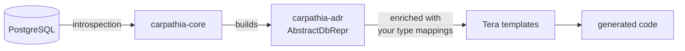

# carpathia-adr — Abstract Database Representation

> The canonical database schema contract for the [carpathia](https://github.com/sdoerig/carpathia) code generator. Write your Tera templates against it — in any language you like.

`carpathia-adr` defines the **Abstract Database Representation (ADR)**: a canonical, language-agnostic model of a PostgreSQL schema, including tables, views, columns, constraints, primary and foreign keys.

It is deliberately **not** part of `carpathia-core`. The ADR is a *contract*: it is the stable interface between carpathia and you, the template writer. Templates render whatever the ADR provides — and the ADR promises to provide it in a deterministic, well-versioned shape.

## Where it fits




| Crate            | Role                                                          |
| ---------------- | ------------------------------------------------------------- |
| `carpathia-adr`  | The schema contract — types and enrichment logic (this crate) |
| `carpathia-core` | Database introspection and template execution                 |
| `carpathia-cli`  | Command-line frontend for end users                           |


## Features

- **Canonical schema model** — `AbstractDbRepr` holds tables, views, columns, constraints, and primary/foreign keys as typed Rust structs.
- **Deterministic ordering** — tables, attributes, and imports are stored in `BTreeMap`/`BTreeSet`, so every template run produces byte-identical output. Check your generated code into git without diff noise.
- **User-defined type mappings** — map database types to your target-language types (`u_type`) and collect the required imports (`u_imports`), e.g. `text` → `String`, `uuid` → `Uuid`.
- **Language-safe names** — every identifier gets a `u_`-prefixed counterpart (`u_table_name`, `u_column_name`) that you can rename freely via a name-mapping table.
- **Tera-ready** — `AdrTemplateData` converts the ADR into plain vectors/strings that Tera can iterate over, while preserving the deterministic order.
- **Serializable** — the whole ADR implements `Serialize`/`Deserialize`, so it can be persisted, inspected, or shipped around as JSON.

## What's inside


| Module                             | Contents                                                                             |
| ---------------------------------- | ------------------------------------------------------------------------------------ |
| `adr::abstract_db_repr`            | `AbstractDbRepr`, `AbstractTableRepr`, `AbstractAttribute`, constraints, PK/FK types |
| `adr::enrich_adr`                  | `add_user_mapping_to_adr` — apply your type and name mappings to the ADR             |
| `adr::tera_conversion`             | `AdrTemplateData` / `TableTemplateData` — the shape Tera templates receive           |
| `db_type::db_to_user_type_structs` | `Types`, `TypeMapping` — the serializable mapping configuration                      |
| `db_type::db_type_mapping`         | `get_db_types` — discover all types used in the schema to build your mapping         |
| `adr_errors`                       | `AdrError` for ADR construction and discovery failures                               |


## Usage

Add it to your `Cargo.toml`:

```toml
[dependencies]
carpathia-adr = "0.1.0"
```

Enrich an existing ADR with your type mappings:

```rust
use carpathia_adr::adr::abstract_db_repr::AbstractDbRepr;
use carpathia_adr::adr::enrich_adr::add_user_mapping_to_adr;
use carpathia_adr::adr::tera_conversion::AdrTemplateData;
use carpathia_adr::db_type::db_to_user_type_structs::Types;

// `adr` is built by carpathia-core from your PostgreSQL schema.
// `types` is your mapping configuration (loadable from JSON/TOML).
let mut adr: AbstractDbRepr = /* ... */;
let types: Types = /* ... */;

// Apply mappings: u_type, u_imports, u_table_name, u_column_name
add_user_mapping_to_adr(&types, &mut adr);

// Hand the ADR to your Tera templates
let template_data = AdrTemplateData::from(&adr);
```

A minimal Tera template against the enriched ADR:

```jinja

pub struct {{ table.u_table_name }} {
    
    pub {{ attr.u_column_name }}: {{ attr.u_type }},
    
}

```

## ADR versioning is a template contract

The ADR carries its own version (`ABSTRACT_DB_REPR_VERSION`), independent of carpathia's software version. It is a promise to your templates:

- **Major** (`0.1.0` → `1.0.0`): breaking changes — templates written against the old version may no longer compile or render.
- **Minor** (`0.1.0` → `0.2.0`): additive changes — existing templates keep working; new attributes are available if you want them.
- **Patch** (`0.1.0` → `0.1.1`): bug fixes only — e.g. a constraint flag that was reported incorrectly now reports correctly.

Before upgrading, check the ADR version and your template usage against the changelog.

## Status

This crate is part of the carpathia workspace and follows its [alpha status](https://github.com/sdoerig/carpathia). The ADR schema may still gain minor (additive) changes during the `0.x` series.

## License

Licensed under [Apache-2.0](https://github.com/sdoerig/carpathia/blob/main/LICENSE).

## Contributing

Contributions follow the [Developer Certificate of Origin](https://github.com/sdoerig/carpathia/blob/main/DCO.md) (DCO 1.1). Sign off your commits with:

```bash
git commit -s -m "Your commit message"
```