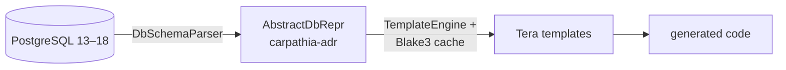

# carpathia-core — The Engine Behind Code Generation

> A reusable Rust library for parsing PostgreSQL schemas and generating code via Tera templates. No CLI required.

`carpathia-core` is the engine behind the [`carpathia-cli`](https://github.com/sdoerig/carpathia) tool. It introspects your database, builds a canonical schema model, and renders whatever code you describe in Tera templates — in any language, not just Rust.

Use it directly in your own tools, build scripts, or CI pipelines:

1. **Introspect** — connect to PostgreSQL and extract schema metadata (tables, views, constraints, comments, user-defined types).
2. **Represent** — turn the schema into an [`AbstractDbRepr`](https://crates.io/crates/carpathia-adr) (ADR): the canonical, deterministic, serializable contract shared with your templates.
3. **Render** — execute your Tera templates with full schema context, generating only what has changed.



`carpathia` is **not an ORM** and never will be. It is a declarative, language-agnostic code generator: you decide what gets generated and what it looks like.

## ✅ Features

- 🧠 **Schema extraction** — full PostgreSQL introspection: tables, views, constraints, primary and foreign keys, comments, and user-defined types. Tested against PostgreSQL 13–18.
- 📜 **Canonical representation** — the ADR (provided by the [`carpathia-adr`](https://github.com/sdoerig/carpathia/tree/main/carpathia-adr) crate) is the stable contract between parser and template engine.
- ⚡ **Delta-aware regeneration** — a Blake3-based cache (`carpathia_cache.json`) stores hashes of each table's/view's schema and each template's content. Only changed entities are re-rendered — and rendered files whose template or database object disappeared are cleaned up.
- 🧩 **Tera template engine** — render any output: Rust structs, DTOs, SQL, documentation, you name it.
- 🔄 **Type &amp; name mappings** — map database types (`text` → `String`, `uuid` → `Uuid`) and rename database identifiers to language-safe names (e.g. a table called `match` becomes valid Rust).
- 📦 **Template bootstrap** — unpack a ready-made example template pack to disk so you don't start from zero.
- 🔌 **Extensible** — add support for other databases by implementing the `DatabaseQuerier` trait.

## 🚀 Quick Start

Add it to your `Cargo.toml`:

```toml
[dependencies]
carpathia-core = "0.3.0"
tokio = { version = "1", features = ["rt-multi-thread", "macros"] }
```

Configure, introspect, generate:

```rust
use carpathia_core::configuration::carpathia_conf::CarpathiaConfigBuilder;
use carpathia_core::configuration::conf_enums::{CacheModus, DbType};
use carpathia_core::db::parse_db_schema::DbSchemaParser;
use carpathia_core::generator::template_engine::TemplateEngine;

#[tokio::main]
async fn main() -> Result<(), Box<dyn std::error::Error>> {
    let config = CarpathiaConfigBuilder::new()
        .db_type(DbType::Postgres)
        .db_host("localhost")
        .db_port(5432)
        .db_user("postgres")
        .db_password("postgres")
        .db_name("carpathia")
        .cache_modus(CacheModus::UseCache)
        .template_directory("./templates/rust_lib")
        .output_directory("./generated")
        .carpathia_type_mapping("carpathia_type_mapping.json")
        .build()?;

    // Introspect the database -> AbstractDbRepr (async)
    let adr = DbSchemaParser::parse_schema(&config).await?;

    // Render the templates (sync, delta-aware)
    TemplateEngine::generate_code(&config, &adr)?;

    println!("Code generation completed!");
    Ok(())
}
```

### First run: build your type mapping

Before you can map database types to your own types, you need to know which types your schema uses. Flip on `print_db_types` (or call `get_db_types`) to get a skeleton mapping file:

```rust
let config = CarpathiaConfigBuilder::new()
    // ... database settings as above ...
    .print_db_types(true)   // prints all types found in the schema
    .execute_templates(false)
    .build()?;
```

Fill in the printed `u_type` / `u_import` pairs, save the file as your type mapping, and point `carpathia_type_mapping` at it.

### Start from a template pack

You don't have to write your first templates from scratch. `extract_to_disk` unpacks an embedded example template pack (via `InitTemplate::RustLib`) into your template directory:

```rust
use carpathia_core::configuration::conf_enums::CacheModus;
use carpathia_core::templates::enum_templates::InitTemplate;
use carpathia_core::templates::init_templates::extract_to_disk;

let config = CarpathiaConfigBuilder::new()
    // ... database settings as above ...
    .init_template(InitTemplate::RustLib)
    .template_directory("./templates")
    .cache_modus(CacheModus::UseCache)
    .build()?;

extract_to_disk(&config)?; // one-time bootstrap
```

## 📂 Template Conventions

The `TemplateEngine` picks up every `*.tera` file in your template directory and dispatches by name prefix:


| Template file    | Context                    | Output                   |
| ---------------- | -------------------------- | ------------------------ |
| `tables.*.tera`  | one `table` per rendering  | one file per table       |
| `views.*.tera`   | one `table` per rendering  | one file per view        |
| `summary.*.tera` | `tables` and `views` lists | one file (e.g. `mod.rs`) |


All ADR fields are available in templates: `{{ table.u_table_name }}`, `{{ attr.u_type }}`, `{{ attr.u_column_name }}`, `{{ table.comment }}`, primary and foreign key properties, imports, and more. See the [`carpathia-adr`](https://github.com/sdoerig/carpathia/tree/main/carpathia-adr) README for the full data model.

## 🗂 Module Overview


| Module          | Contents                                                                                      |
| --------------- | --------------------------------------------------------------------------------------------- |
| `configuration` | `CarpathiaConfigBuilder`, `DbType`, `CacheModus`, `InitTemplate` enums, config file reading   |
| `db`            | `DbSchemaParser::parse_schema`, the `DatabaseQuerier` trait, PostgreSQL implementation        |
| `generator`     | `TemplateEngine::generate_code`, template discovery and dispatch (`Template`, `TemplateType`) |
| `cache`         | `Cache`, hash-based change detection in `carpathia_cache.json`                                |
| `templates`     | `extract_to_disk`, embedded example template packs                                            |
| `return_values` | `CarpathiaError` and error numbers                                                            |


## 🧩 Extending carpathia-core

- Implement `DatabaseQuerier` for another database (MySQL, SQLite, ...) and wire it into `DbSchemaParser`.
- Add new `TemplateType` dispatches for new output categories (e.g. documentation, DTOs).
- Enhance the type mapping with your own imports and macros.

## 🧪 Testing

Integration tests run against the [Pagila](https://github.com/devrimgunduz/pagila-src) sample schema and need a reachable PostgreSQL instance (see `.env.test`):

```bash
cargo test -- --test-threads=1
```

## 📜 License

Licensed under [Apache-2.0](https://github.com/sdoerig/carpathia/blob/main/LICENSE).

## 🤝 Contributing

Contributions follow the [Developer Certificate of Origin](https://github.com/sdoerig/carpathia/blob/main/DCO.md) (DCO 1.1). Sign off your commits with:

```bash
git commit -s -m "Your commit message"
```